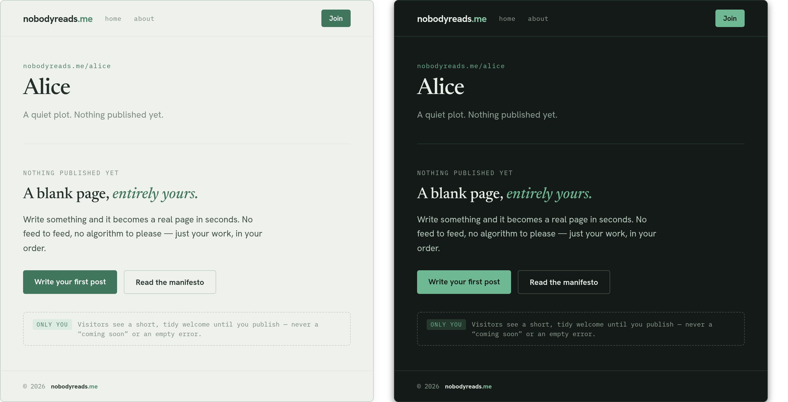
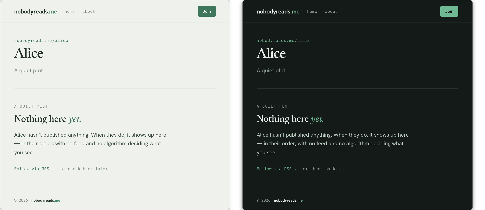
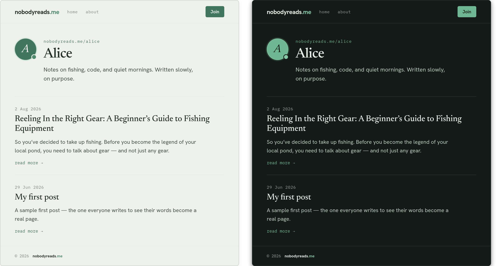
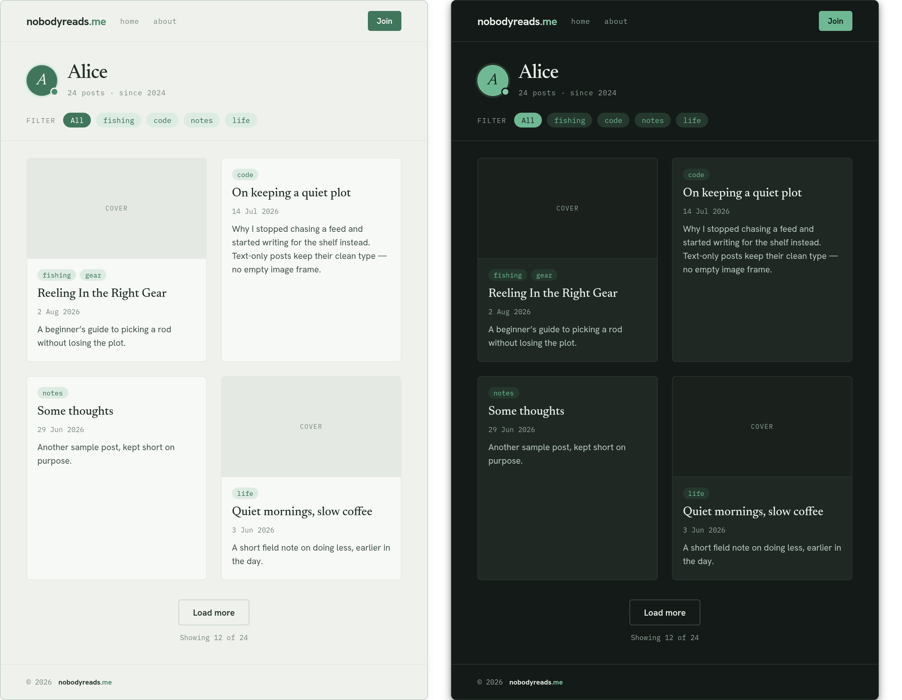
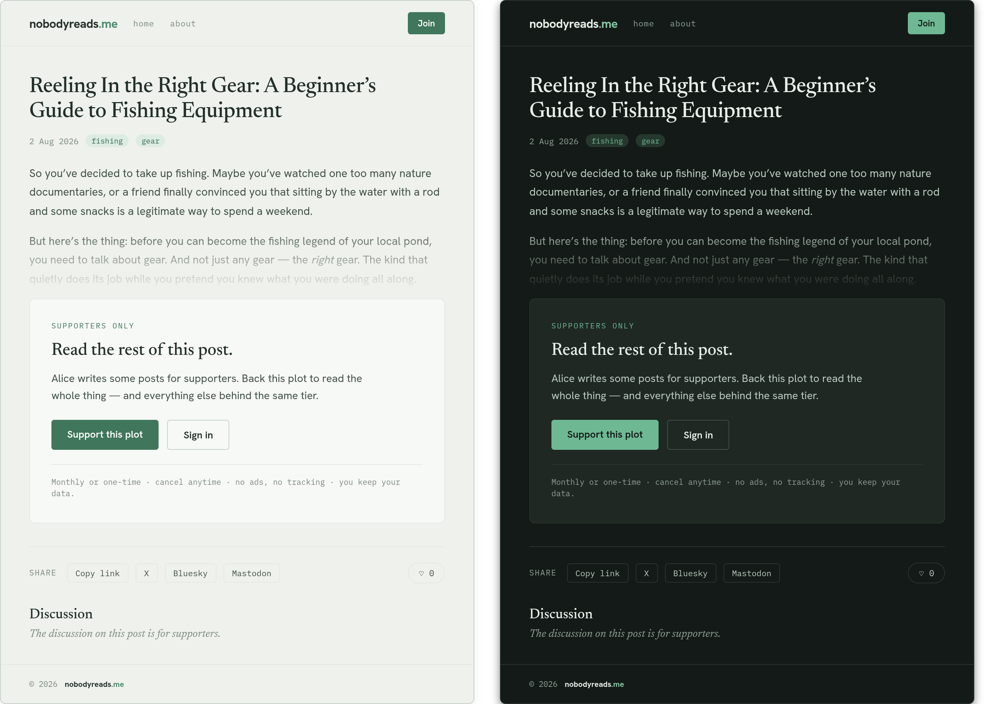

# Design: Plot pages across the content-density spectrum

> Status: approved comps, ready to implement. Author: design. Palette: **Forest & Oat**
> (light + dark), no new tokens. Reference prototype: `docs/designs/plot-density-comps.dc.html`
> (open in a browser — it renders all states, both themes, side by side).

## 1. What this is

The shared plot template (`nobodyreads.me/<nickname>`) must look intentional at every content
level — from a plot with **zero posts** to one with **hundreds**. Today it renders the same flat
`date · title · excerpt · read more` list regardless of count, so a new plot reads as broken and a
prolific one degrades into an undifferentiated scroll.

This spec gives the existing template hook points real designs and adds the few structural pieces
that don't exist yet. **It is template-level** — the owner still authors their home page as
markdown; none of this requires them to give that up.

### Levers this builds on (already in the template system)
- `showHero` (currently defaulted **off**) — header hero. We turn it into the identity anchor.
- `postPreview: default | compact | card` — post-list variant. We give `card` a real design.
- `tags: string[]` — exists on every post in the data model, surfaced nowhere in the UI today.
- `limit` on list queries (capped 200) — exists, but nothing paginates past it.

### New pieces to add
- **Empty state** (owner vs. visitor variants) — does not exist.
- **Tag filter row** — chips that filter the list.
- **Load-more** control + "showing X of Y" count.
- **Cover thumbnail** support on the `card` variant, with a text-only fallback.
- **Redesigned supporter-paywall card** on the post page.

### Progressive disclosure rule
Wayfinding appears **only when there's enough content to need it.** Never show a tag filter or
load-more on a sparse plot.

| Posts | Hero | List variant | Tag filter | Load-more |
|---|---|---|---|---|
| 0 | on (identity + empty state) | — | no | no |
| 1–3 (sparse) | on (identity + tagline + monogram) | `default` rows | no | no |
| ~10–30 (established) | on (compact) | `card` grid | **yes** | **yes** (if > page size) |
| 100+ (prolific) | on (compact) | `card` grid | yes | yes |

---

## 2. Tokens (do not invent new ones)

All colors come from `astro/styles/tokens.css` (`:root` for light, `html[data-theme="dark"]` for
dark). Use the CSS variables — never hard-code hex. Names used by this design:

`--bg`, `--bg-tint`, `--bg-card`, `--ink`, `--body`, `--muted`, `--accent`, `--accent-bright`,
`--on-accent`, `--border`, `--border-strong`, `--chip-bg`, `--chip-fg`, `--radius` (4px),
`--radius-sm` (2px), `--radius-lg` (8px), `--shadow-sm`, `--shadow-md`.

**Type** (from tokens): `--f-display` = Newsreader (serif; headings, post titles, empty-state
headline — weight 500, italic for accent words), `--f-sans` = Hanken Grotesk (body/UI),
`--f-mono` = IBM Plex Mono (labels, meta, dates, eyebrows, chips — uppercase + wide tracking for
eyebrows).

**Shape language:** 1px hairline borders (`--border`) between rows and sections; cards
`--radius-lg`; buttons/chips `--radius` or pill (`999px`) for filter chips. No drop shadows or
gradients beyond `--shadow-sm/md` (the one exception is the paywall fade — see §6).

Both themes are the same role map — build once with CSS vars and a `[data-theme]` override. Every
element below must render in both.

---

## 3. Shared chrome (all plot pages)

**Header** — flex row, space-between, `padding: 16px 40px` (page gutter), bottom `1px solid
--border`.
- Wordmark: `nobodyreads` in `--f-sans` **800**, `font-size: 17px`, `letter-spacing: -0.02em`,
  color `--ink`; `.me` suffix in `--accent-bright`.
- Nav: `home`, `about` — `--f-mono` 11.5px, `letter-spacing: 0.04em`, color `--muted`, → `--ink`
  on hover.
- Right: **Join** button — fill `--accent`, text `--on-accent`, 12.5px/600, `padding: 7px 14px`,
  `border-radius: --radius`. (Mobile keeps the existing burger.)

**Footer** — top `1px solid --border`, `padding: 20px 40px`, `--f-mono` 11px `--muted`:
`© 2026` + the wordmark repeated.

**Content column** — max reading width ~600–620px of text inside the 40px gutters; the card grid
(§5) may go full content width.

---

## 4. State: EMPTY (0 posts)

_Owner view (light | dark)._

_Visitor view (light | dark)._

The hero is the anchor. Below it, an empty state that reads as *calm and intentional*, not broken.
Two audiences see different things — **build both.**

### 4a. Hero (both audiences)
- Eyebrow: `--f-mono` 11.5px, `letter-spacing: 0.08em`, color `--accent` — the plot URL,
  e.g. `nobodyreads.me/alice`.
- Title: `--f-display` 500, 40px, `line-height: 1`, `letter-spacing: -0.02em`, `--ink` — the plot's
  display name.
- Tagline: `--f-sans` 16px, `--muted`. Owner default: "A quiet plot. Nothing published yet."

### 4b. Owner view (only the authenticated owner sees this)
Below a `1px --border` top rule, `padding-top: 44px`:
- Eyebrow `--f-mono` 11px uppercase `letter-spacing: 0.14em` `--muted`: **"Nothing published yet"**.
- Headline `--f-display` 500, 27px, `--ink`: **"A blank page, _entirely yours._"** (the last two
  words italic + `--accent`).
- Body `--f-sans` 15.5px/1.65 `--body`, max-width 430px: "Write something and it becomes a real
  page in seconds. No feed to feed, no algorithm to please — just your work, in your order."
- Actions (flex, gap 12px): primary **"Write your first post"** (fill `--accent`, `--on-accent`,
  14px/600, `padding: 11px 20px`, `--radius`) → links to the editor; secondary **"Read the
  manifesto"** (transparent, `1px --border-strong`, `--ink`).
- **Owner-only note** — a `1px dashed --border-strong` box, `--radius` 6px, `padding: 12px 16px`,
  flex gap 10px:
  - A pill labelled **"Only you"** — `--f-mono` 10px uppercase, bg `--chip-bg`, text `--accent`,
    `padding: 3px 7px`, pill radius.
  - Note text `--f-mono` 11.5px/1.5 `--muted`: "Visitors see a short, tidy welcome until you
    publish — never a 'coming soon' or an empty error."
  - This box must **only** render for the owner. It is guidance, not public content.

### 4c. Visitor view (anyone who is not the owner)
Same hero. Below the top rule:
- Eyebrow `--f-mono` 11px uppercase `--muted`: **"A quiet plot"**.
- Headline `--f-display` 500, 27px: **"Nothing here _yet._"** (`yet.` italic + `--accent`).
- Body `--f-sans` 15.5px/1.65 `--body`: "<Name> hasn't published anything. When they do, it shows
  up here — in their order, with no feed and no algorithm deciding what you see."
- Affordance row (flex, gap 18px): **"Follow via RSS →"** (`--f-mono` 12px `--accent`, links to
  `/<nickname>/feed.xml`) + "or check back later" (`--f-mono` 12px `--muted`).
- **No** CTA buttons, **no** owner-only note.

---

## 5. State: SPARSE (1–3 posts)

Hero carries weight so the page never reads as "empty list + whitespace."

### Hero (with monogram)
Flex row, gap 20px, align-items flex-start:
- **Monogram avatar** (see §8) — 60px.
- Eyebrow (plot URL) + title (`--f-display` 500, 38px) + tagline (`--f-sans` 16px `--body`,
  the owner's real tagline, e.g. "Notes on fishing, code, and quiet mornings.").

### Post list — `default` rows
Each post separated by a `1px --border` top rule, `padding: 26px 0`:
- Date `--f-mono` 11.5px `--muted`.
- Title `--f-display` 500, 23px/1.2 `--ink`.
- Excerpt `--f-sans` 15px/1.6 `--body`, max-width ~520px.
- **"read more →"** `--f-mono` 12px `--accent`.

No tag filter, no load-more at this density.

---

## 6. State: ESTABLISHED (~10–30 posts)  → also serves PROLIFIC (100+)

### Compact hero
Flex row, gap 16px, align-items center: 48px monogram + name (`--f-display` 500, 30px) + a
`--f-mono` 11px `--muted` meta line: "24 posts · since 2024".

### Tag filter row
Below a `1px --border` rule, flex wrap, gap 8px, `padding-bottom: 20px`:
- Label **"Filter"** — `--f-mono` 10.5px uppercase `letter-spacing: 0.12em` `--muted`.
- Chips, pill radius, `--f-mono` 11.5px, `padding: 4px 11px`:
  - Active (**"All"** by default): bg `--accent`, text `--on-accent`.
  - Inactive (`tags` from the data model): bg `--chip-bg`, text `--chip-fg`.
- Clicking a chip filters the list to that tag (client-side or query param — implementer's choice;
  the list query already accepts a filter). "All" clears it.

### Post list — `card` variant
CSS grid, **2 columns**, gap 22px (collapse to 1 column ≤ ~720px). Card = bg `--bg-card`,
`1px --border`, `--radius` 6px, flex column.

**Card with cover** (posts that have one):
- Cover region: `aspect-ratio: 16/9`, bg `--bg-tint`, bottom `1px --border`, the post's cover
  image `object-fit: cover`. (In the comp this is a labelled placeholder.)
- Body `padding: 16px 16px 18px`: tag chips (pill, `--f-mono` 10.5px, `--chip-bg`/`--chip-fg`) →
  title (`--f-display` 500, 19px/1.2) → date (`--f-mono` 11px `--muted`) → excerpt
  (`--f-sans` 13.5px/1.55 `--body`).

**Card without cover** (text-only fallback):
- **Omit the cover region entirely** — no empty image frame, no grey box. Same body block; the card
  is simply shorter. Grid items align to the top of their row so mixed heights look intentional.

### Load-more
Centered below the grid, flex column gap 12px:
- **"Load more"** button — transparent, `1px --border-strong`, `--ink`, 13.5px/600,
  `padding: 10px 22px`, `--radius`. Appends the next page (respect the query `limit`).
- Count line `--f-mono` 11px `--muted`: "Showing 12 of 24". Hide the button when all are shown.

---

## 7. Post page — supporter paywall

Shares the template primitives. Layout top→bottom inside the content column:

1. **Title** — `--f-display` 500, 30px/1.15, `--ink`, max-width ~520px.
2. **Meta row** (flex, gap 10px): date `--f-mono` 11.5px `--muted` + tag chips (pill,
   `--chip-bg`/`--chip-fg`).
3. **Truncated body** — the free portion, `--f-sans` 15.5px/1.7 `--body`. At the bottom, a
   **soft fade** overlay: an absolutely-positioned 96px band, `background: linear-gradient(to
   bottom, transparent, var(--bg))`, `pointer-events: none`. This is the one allowed gradient — it
   is functional (fades truncated text into the page), built from `--bg`, not decoration.
4. **Paywall card** — bg `--bg-card`, `1px --border`, `--radius-lg`, `padding: 30px`:
   - Eyebrow `--f-mono` 10.5px uppercase `letter-spacing: 0.14em` `--accent`: **"Supporters only"**.
   - Heading `--f-display` 500, 24px `--ink`: **"Read the rest of this post."**
   - Body `--f-sans` 15px/1.6 `--body`: "<Name> writes some posts for supporters. Back this plot to
     read the whole thing — and everything else behind the same tier."
   - Actions (flex, gap 12px): primary **"Support this plot"** (fill `--accent`, `--on-accent`) →
     checkout; secondary **"Sign in"** (`1px --border-strong`, `--ink`) → `/login`. Two intents:
     new supporter vs. existing member who's already entitled.
   - Reassurance line — top `1px --border`, `padding-top: 16px`, `--f-mono` 11px/1.5 `--muted`:
     "Monthly or one-time · cancel anytime · no ads, no tracking · you keep your data." (manifesto
     voice.)
5. **Share row** — top `1px --border`, `padding-top: 22px`, flex wrap gap 10px: "Share" label
   (`--f-mono` 11px uppercase `--muted`) + outlined chips (Copy link, X, Bluesky, Mastodon —
   `1px --border`, `--radius`, `--f-mono` 11.5px `--body`). Like pill on the right: `♡ 0`, pill
   border `--border`.
6. **Discussion** — heading `--f-display` 500, 20px; for gated posts the note is
   `--f-display` *italic* 15px `--muted`: "The discussion on this post is for supporters."

---

## 8. Owner monogram avatar

Used in the sparse (60px) and established (48px) heros. It is a real element — keep it, don't drop
to a bare letter.

- Outer: `position: relative`, square (60 / 48px), `flex-shrink: 0`.
- Disc: full circle, bg `--accent`, letter in `--on-accent`, `--f-display` **italic** (31px @ 60,
  24px @ 48). `box-shadow: inset 0 0 0 1px rgba(255,255,255,0.16), 0 0 0 3px var(--chip-bg)` — the
  inset gives a thin highlight ring, the spread gives a soft halo in the plot's chip tint.
- Accent dot: absolutely positioned bottom-right, 11px (60) / 9px (48) circle, bg
  `--accent-bright`, `box-shadow: 0 0 0 2px var(--bg)` so it reads as a separate mark — echoes the
  `.me` dot in the wordmark.
- If the owner uploads a real avatar image later, it replaces the disc; keep the halo ring + dot.

---

## 9. Responsive

Follow the landing page's ≤720px rules: gutters 24px, hero title clamps down (~28–30px), card grid
→ 1 column, nav → burger. Vertical section padding reduces ~40%.

## 10. Files
- `docs/designs/img/*.png` — rendered reference images of every state (both themes), embedded
  above: `01-empty-owner`, `02-empty-visitor`, `03-sparse`, `04-established`, `05-post-paywall`.
- `docs/designs/plot-density-comps.dc.html` — the visual source of truth (all states, both themes).
  It uses a small preview wrapper (`<x-dc>` / streaming tool) — **ignore that scaffolding**; only
  the markup, inline styles, and token usage matter. Recreate in the Astro/package templates using
  the existing `var(--*)` tokens, not ported inline styles.
- `astro/styles/tokens.css` — the token source of truth (do not duplicate hexes).
- Levers: `showHero`, `postPreview`, `tags`, list `limit` (see the `nobodyreads` package templates
  and `src/tenant/routes.ts`).
